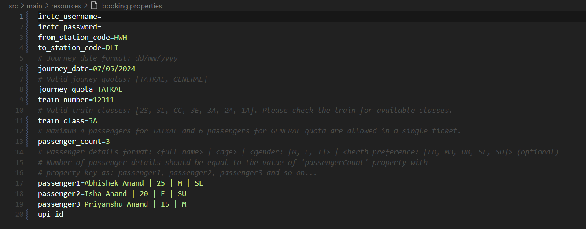

# IRCTC Ticket Booking
The project is made to book ticket from the [IRCTC](https://www.irctc.co.in) website, preferably **tatkal** ticket.

#### Tech Stacks Used
- In this project I have used Java (version: 1.8) and Selenium.

#### Steps before running the booking script.
- Download the web driver of the chrome browser for the version installed in your computer and put the driver in the [resources](src/main/resources) folder under sub-folder name **localdata**.
- Add all the required properties in [booking.properties](src/main/resources/booking.properties) file found under [resources](src/main/resources) folder.
- Mandatory properties that should be present in the earlier mentioned property file are: IRCTC username (**irctc_username**), IRCTC password (**irctc_password**), from station code (**from_station_code**), to station code (**to_station_code**), journey date (**journey_date**), journey quota (**journey_quota**), train number (**train_number**), train class (**train_class**), number of passengers (**passenger_count**), passenger details with property keys pattern as **passenger1**, **passenger2** and so on, and finally the upi id (**upi_id**).
    - Journey date property should have date in the format: **dd/mm/yyyy**. E.g. 26/01/2024. The date should not be in the past. Valid dates for  **tatkal** journey quota are current date and next day date from the current date according to Indian timezone.
    - Supported journey quota property values are: **TATKAL, GENERAL**.
    - Valid train class property values are: second sitting chair - non AC (**2S**), sleeper - non AC (**SL**), chair car - AC (**CC**), three tier AC economy (**3E**), three tier AC (**3A**), two tier AC (**2A**), two tier first AC (**1A**). **_1A_** train class is not supported for **_tatkal_** ticket.
    - Number of passengers (**passenger_count**) property should have value greater than zero (**0**), it should be less than or equal to **4** for **tatkal** quota and it should be less than or equal to **6** for **general** quota ticket.
    - Passenger details should be equal to the value of number of passengers property. Passenger details should be in th format: **<full name> | <age> | <gender> | <berth preference>**. 
        - Passenger full name should not contain any abbreviations, it should be as per any government id. 
        - Passenger age should be between **1** and **125**. 
        - Valid passenger gender are: male (**M**), female (**F**) and transgender (**T**). 
        - Valid berth preference are: lower berth (**LB**), middle berth (**MB**), upper berth (**UB**), side lower (**SL**), side upper (**SU**). Berth preference is optional.
        - E.g. If number of passengers are **2** then passenger details should be like:
        **passenger1=Abhishek Anand | 25 | M | SL**
        **passenger2=Isha Anand | 20 | F**
        Notice that berth preference is given for passenger 1 but not for passenger 2 in the above example.
        **_Note: All the passengers should be Indian citizen._**
    - The upi id property should have a valid UPI virtual payment address (VPA).
- 

#### Running the script
- Run the [IRCTCBooking.java](src/main/java/com/example/abhik26/irctc_booking/IRCTCBooking.java) file from any IDE like Eclipse, VS Code, IntelliJ etc to start the booking.
- Two manual interventions are required during the booking process, both for filling captcha. One at the time of logging in and other at the time of review the booking after entering the passenger details.
- Run the file one minute before the actual booking start time i.e. **9:59 AM** if the journey quota is **tatkal** and train class belongs to any AC classes (**CC, 3E, 3A, 2A**) otherwise at **10:29 AM** if train class belongs to any non AC classes (**2s, SL**). For **general** quota ticket, the script can be run anytime. The times are in **Indian Standard Time (IST)**.
- Once the file is run, it will do the pre-booking validations to check if all the required properties are present or not with proper values. If all the validations are passed, it will start the booking script otherwise an exception will be thrown with a message, stating the cause of failure.
- Once the script starts successfully, IRCTC website will open in a new chrome browser window.
- At the time of logggin in, username and password provided in the property file will be filled automatically. Captcha needs to be filled and then login button needs to be clicked manually.
- After successful login the script will continue. Once the passenger details are filled and continue button is clicked, review page will come, here again captcha needs to be filled and continue button needs to be clicked manually.
- After that at payment page the upi id provided in the property file will be filled automatically and pay button will be clicked. Then the user needs to complete the payment in the respective payment app. After the payment is complete the booked ticket status will be shown.